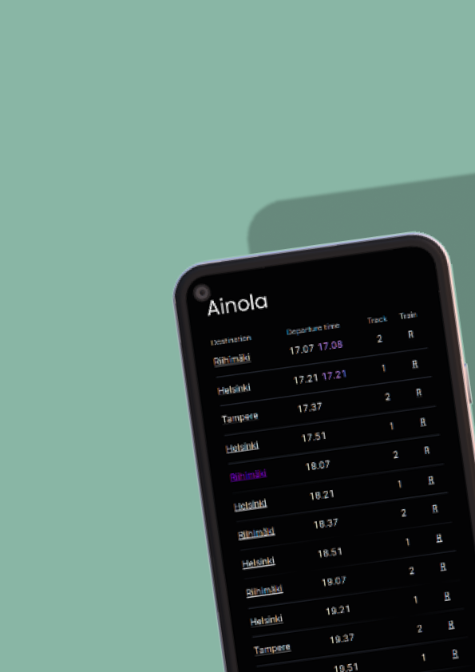

<h1><a href="https://junat.live">Junat.live</a>  </h1>

See Finnish train schedules in real-time. The site uses an MQTT connection to keep the data fresh and updates in a matter of milliseconds.

<table>
<tbody><tr>
<td>

</td>

<td>

</td>
</tr></tbody>
</table>

<sub>Mockups created with [deviceframes.com](https://deviceframes.com)<sub>

## Architecture

Yarn Workspaces with [Turborepo](https://turborepo.org/) is used to keep internal packages in sync. Each of the packages have their own suite of automated tests that can be ran from the root or the package.

The backend currently consists of a headless CMS (Directus) that is used to localize the site for Finnish, English and Swedish.

The repo consists of three main packages:

- ### site

  The site, built on Next.js and deployed to Oracle Cloud.

- ### packages/digitraffic

  A minimal wrapper for [Digitraffic](https://digitraffic.fi)'s REST endpoints. Also provides some extra features such as localized stations for Finnish, English and Swedish.

- ### packages/digitraffic-mqtt
  Utilities for working with Digitraffic's MQTT APIs. For example, you can listen to trains just by initiating the client and asynchoronously looping over any updates:

```js
for await (train of client.trains) {
  console.log(`Train updated: ${train.trainNumber}.`)
}
```

## Developing locally

Previously local installment was impossible, because the build step required a CMS_TOKEN environment variable. Now, all of the assets from the CMS are made public (read access only) so the application can be built by anyone. Node version 14 is required and 14,16 and 18 are tested.

First, clone the repository with your preferred method. Whether that be the Github CLI, degit or just raw git commands.

Then install dependencies. This repository uses Yarn Workspaces so you should have Yarn installed, you can simply run `npm i -g yarn`.

```sh
yarn install
```

Run `yarn dev` from the workspace root or ./site.
