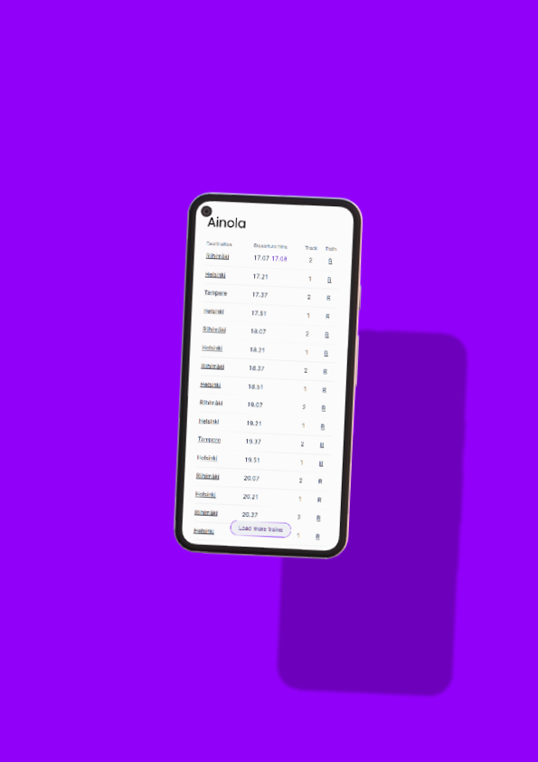

<h1><a href="https://junat.live">Junat.live</a> </h1>

See Finnish train schedules in real-time. The site uses an MQTT connection to keep the data fresh and updates in a matter of milliseconds.


[](https://sonarcloud.io/dashboard?id=junat.live)
[](https://sonarcloud.io/dashboard?id=junat.live)
[](https://sonarcloud.io/dashboard?id=junat.live)
[](https://observatory.mozilla.org/analyze/junat.live)

<table>
<tbody><tr>
<td>

</td>

<td>

</td>
</tr></tbody>
</table>

<sub>Mockups created with [deviceframes.com](https://deviceframes.com)<sub>

## Project structure

Pnpm workspaces with [Turborepo](https://turborepo.org/) is used to keep internal packages in sync. Each of the packages have their own suite of automated tests that can be run from the workspace root or the package in question.

The backend currently consists of a headless CMS (Directus) that is used to localize the site for Finnish, English and Swedish.

The repo consists of three main packages:

- ### site

  The site, built on Next.js and deployed to Oracle Cloud.

- ### packages/digitraffic

  A minimal wrapper for [Digitraffic](https://digitraffic.fi)'s REST endpoints. Also provides some extra features such as localized stations for Finnish, English and Swedish.

- ### packages/digitraffic-mqtt
  Utilities for working with Digitraffic's MQTT APIs. For example, you can listen to trains just by initiating the client and asynchronously looping over any updates:
  ```js
  for await (train of client.trains) {
    console.log(`Train updated: ${train.trainNumber}.`)
  }
  ```

## Developing locally
Node.js version 14 is required; 14, 16 and 18 are tested.

First, clone the repository with your preferred method. Whether that be the Github CLI, degit or just git commands.

This repository uses [pnpm](https://pnpm.io/) for package management so you should have it installed. If you don't, you can simply run `npm i -g pnpm` to install it.

```sh
pnpm install && pnpm dev
```
